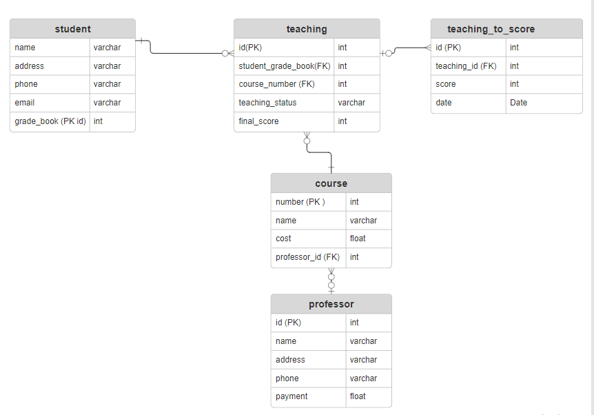

# CourseModel
Тестовое задание для кандидатов 

1) Создать клон данного репозитория	в своем профиле github. Исправить файл readme. Указать ФИО автора, контактную информацию.
2) Разработать схему отношений на на основании модели, представленной в courses.gif
3) Разработать микросервис, реализующий REST-API с CRUD-сервисами для этой модели 
4) Реализовать сервис, позволяющий построить отчет по загрузке препадавательского состава. Поля отчета: ФИО профессора, Суммарное количество студентов по всем курсам, Средння успеваемость студентов по всем курсам. Отчет сформировать в формате xlsx.
5) Разработать web-интерфейс для редактирования списка профессоров. (Дополнительное задание)
6) Прислать merge request

Панинский Вячеслав Владимирович
Контакты:
Телефон: 8-920-970-14-69
Telegram: @SlavOkk
Mail: pancration85@mail.ru

Для удобной проверки тестового задания исползуется база данных (H2) - in memory,которая
поднимается во время запуска приложения.
Так же скрипты liquibase создают строки базовых сущностей в БД.
Подключиться к консоли H2 можно по url "http://localhost:8080/h2-console"/
Так же в качестве документации и удобной проверки был подключен swagger, 
доступный по ссылке "http://localhost:8080/swagger-ui.html#".

